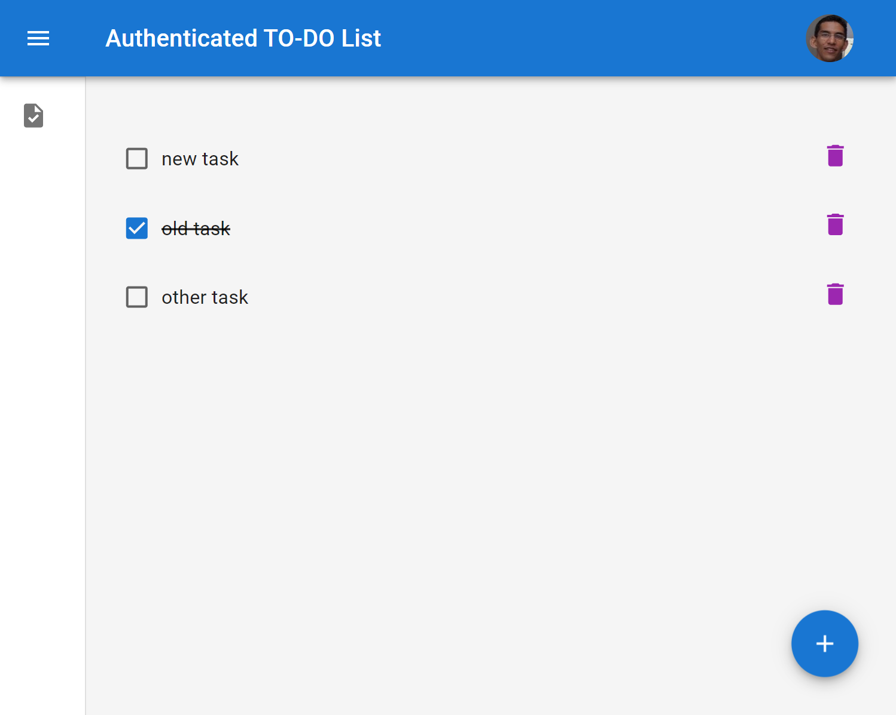
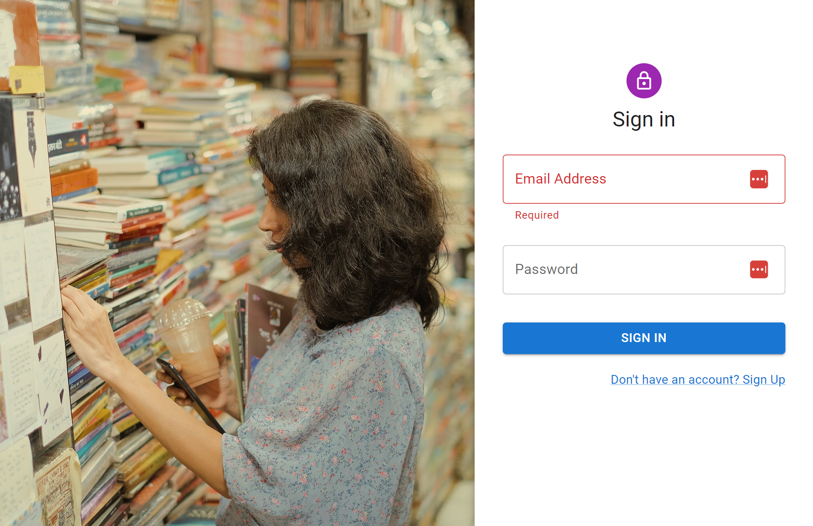
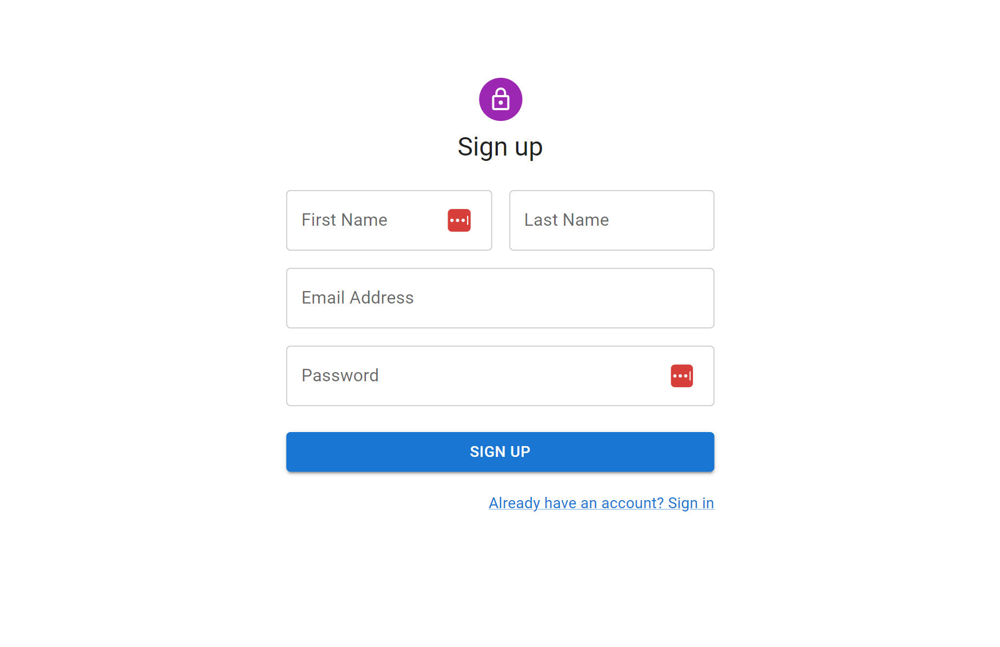

# Authenticated To-Do
## The Challenge
Build an authenticated To-DO list (independent for each user) using supabase as backend and MUI as component library.

## Screenshot
### To-Do

### Sign In

### Sign Up

## Built with
- React
- MUI (Component library)
- React Router
- Gravatar 
- Supabase (Backend as a service )
- Formik
- Yup (Object Schema validation)
- Typescript
- TS-Standard
- Vite

## Links
- [React y Supabase, Aplicacion completa - Auth y CRUD](https://www.youtube.com/watch?v=I1zzgAfSUBQ)
- [MUI](https://mui.com/)
- https://supabase.com/docs/reference/javascript/typescript-support
- https://supabase.com/docs/guides/auth/overview
- https://medium.com/today-i-solved/deploy-spa-with-react-router-to-vercel-d10a6b2bfde8
- https://vercel.com/docs/project-configuration